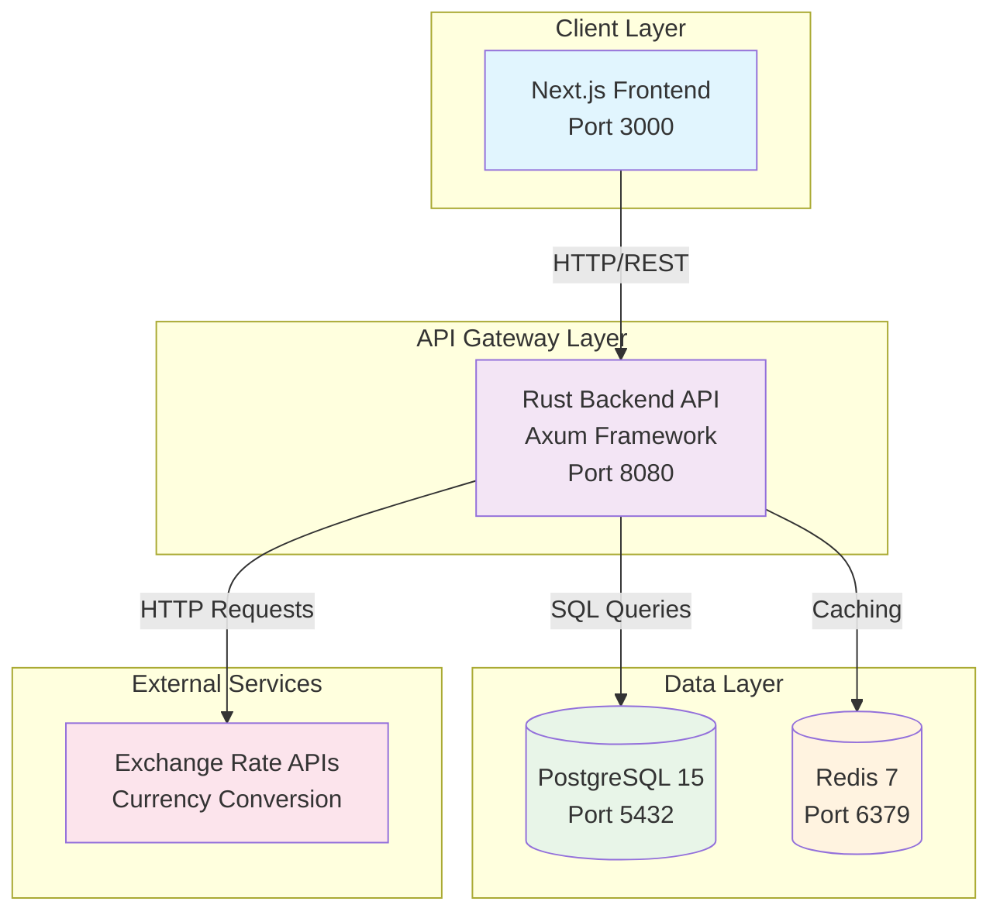
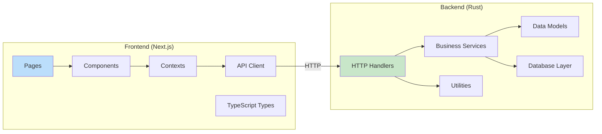
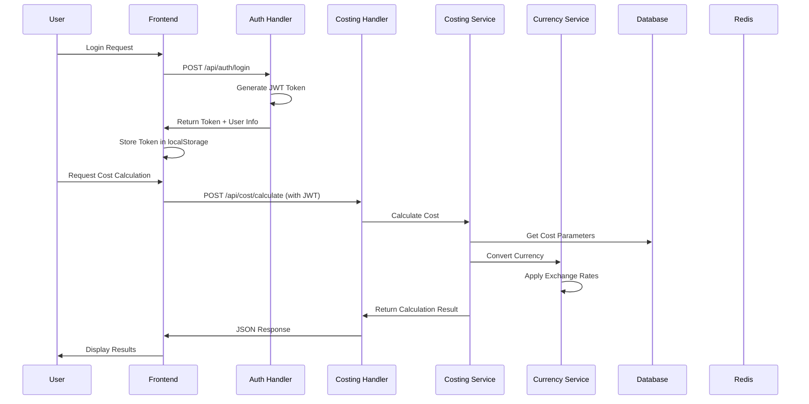
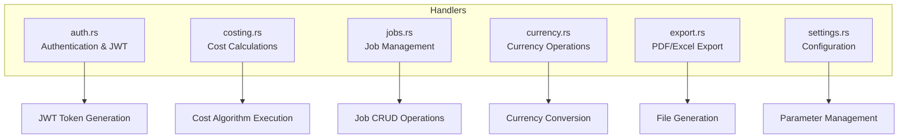
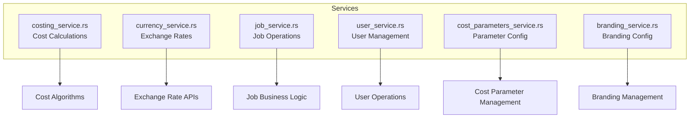
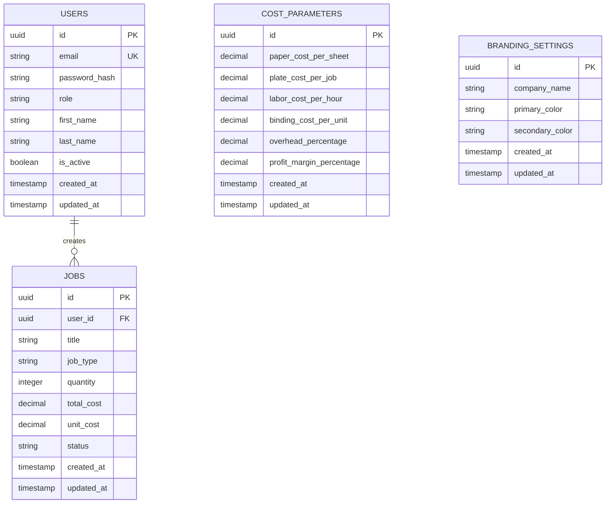
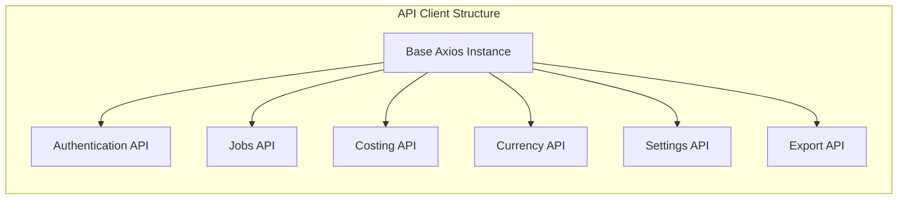
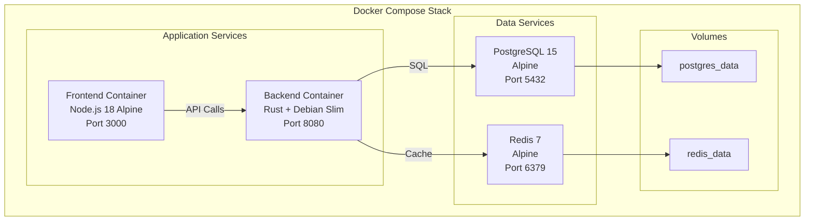
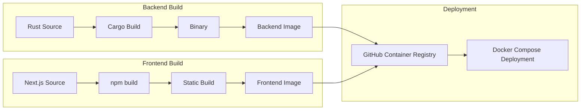
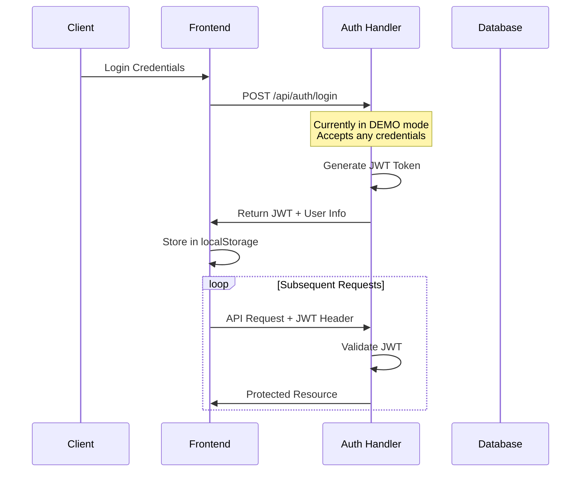

# CostPrint Pro - System Architecture

## Overview

CostPrint Pro is a modern print job costing application built with a microservices-oriented architecture using Rust (backend) and Next.js (frontend), containerized with Docker and orchestrated via Docker Compose.

## System Architecture Diagram



## Component Architecture



## Data Flow Architecture



## Backend Architecture Details

### Handler Layer (`src/handlers/`)
**Responsibility**: HTTP request/response handling, input validation, authentication



**Key Components**:
- `auth.rs`: JWT-based authentication, user session management
- `costing.rs`: Cost calculation endpoints (calculate, preview, quick)
- `jobs.rs`: Full CRUD operations for print jobs
- `currency.rs`: Multi-currency support and conversion
- `export.rs`: PDF and Excel report generation
- `settings.rs`: Cost parameters and branding configuration

### Service Layer (`src/services/`)
**Responsibility**: Business logic implementation, data processing



**Key Responsibilities**:
- **Costing Service**: Implements complex cost calculation algorithms with configurable parameters
- **Currency Service**: Manages exchange rates and currency conversions (currently hardcoded rates)
- **Job Service**: Handles job lifecycle management and business rules
- **User Service**: User authentication and profile management
- **Cost Parameters Service**: Manages configurable cost calculation parameters
- **Branding Service**: Handles company branding and customization

### Data Model Layer (`src/models/` & `src/entities/`)
**Responsibility**: Data structure definitions, serialization/deserialization



### Database Layer (`src/db/`)
**Responsibility**: Database connection management, migrations

- **Sea-ORM Integration**: Modern async ORM for Rust
- **Migration System**: Versioned database schema management
- **Connection Pooling**: Efficient database connection management

## Frontend Architecture Details

### Page Structure (`src/app/`)
```mermaid
graph TD
    ROOT[layout.tsx<br/>Root Layout + AuthProvider]
    HOME[page.tsx<br/>Dashboard Route]
    LOGIN[login/page.tsx<br/>Authentication]
    JOBS[jobs/[id]/page.tsx<br/>Job Details]
    SETTINGS[settings/page.tsx<br/>Configuration]
    
    ROOT --> HOME
    ROOT --> LOGIN
    ROOT --> JOBS
    ROOT --> SETTINGS
```

### Component Architecture (`src/components/`)
- **Dashboard.tsx**: Main application interface with cost calculation forms
- **LoadingSpinner.tsx**: Reusable loading indicator
- **Modular Design**: Components designed for reusability and maintainability

### State Management (`src/contexts/`)
- **AuthContext**: Global authentication state management
- **JWT Token Handling**: Automatic token injection and refresh
- **Local Storage Integration**: Persistent authentication state

### API Client (`src/lib/api.ts`)


**Features**:
- **Request Interceptors**: Automatic JWT token injection
- **Response Interceptors**: Global error handling and authentication redirects
- **Type Safety**: Full TypeScript integration with backend models
- **Error Handling**: Centralized error processing and user feedback

## Infrastructure Architecture

### Docker Architecture


### Build Process


## Security Architecture

### Authentication Flow


**Current Security Measures**:
- JWT token-based authentication
- bcrypt password hashing (when implemented)
- CORS configuration
- Non-root Docker containers
- Input validation with Rust's type system

**Security Limitations** (MVP Status):
- Demo authentication mode (accepts any credentials)
- Hardcoded JWT secrets
- Missing rate limiting
- No CSRF protection

## Performance Considerations

### Database Performance
- **Connection Pooling**: Sea-ORM manages database connections
- **Async Operations**: Full async/await support throughout the stack
- **Indexing Strategy**: Basic indexes on foreign keys and status fields

### Caching Strategy
- **Redis Integration**: Prepared for caching exchange rates and cost calculations
- **Frontend Caching**: Browser-based caching for static assets
- **API Response Caching**: Potential for implementing response caching

### Scalability Design
- **Stateless Architecture**: JWT tokens enable horizontal scaling
- **Microservice Ready**: Clean separation allows for service extraction
- **Container Orchestration**: Docker Compose foundation for Kubernetes migration

## Development Workflow

### Local Development


### CI/CD Pipeline
- **Automated Builds**: GitHub Actions on push to main
- **Multi-stage Builds**: Optimized Docker images
- **Container Registry**: GitHub Container Registry for image storage
- **Health Checks**: Built-in health monitoring for all services

## Configuration Management

### Environment Variables
- **Backend**: Database URL, Redis URL, JWT secrets, CORS origins
- **Frontend**: API URLs, environment mode
- **Docker**: Service configuration and networking

### Configuration Files
- **Cargo.toml**: Rust dependencies and build configuration
- **package.json**: Node.js dependencies and scripts
- **docker-compose.yml**: Service orchestration and networking
- **Dockerfile**: Multi-stage build configurations

This architecture provides a solid foundation for a print costing application with clear separation of concerns, type safety, and modern deployment practices. The MVP status is reflected in simplified authentication and hardcoded exchange rates, which are clearly marked for future enhancement.
